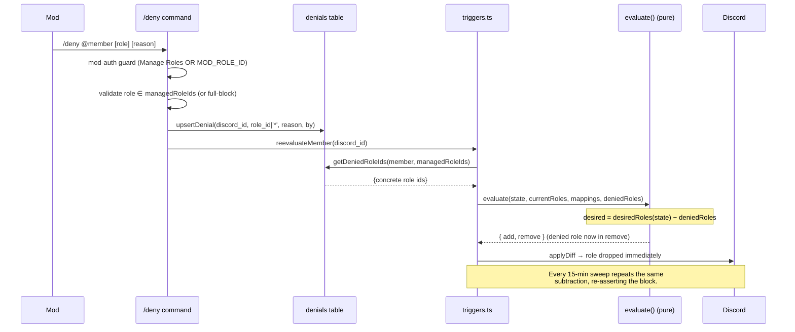

# feat: Channel moderation override (deny-list)

**Target repo:** andamio-bot · **Stack:** TypeScript, discord.js, better-sqlite3

## Summary

Today the gating system only ever **grants** roles: `evaluate()` computes the managed roles a member's Andamio credentials earn and applies the diff, and a 15-minute sweep (`reevaluateAll`) re-asserts that computation on every tick. A moderator who manually removes a credential-derived role in Discord sees it re-added on the next sweep.

This plan adds a **durable, moderator-controlled deny-list** that overrides the grant. A denial lives in the bot's own SQLite state and is **subtracted from the desired set inside the pure evaluator**, so the block is re-asserted on every sweep instead of eroded by it — the survival property falls out of the existing loop for free. Moderators manage denials with three new commands (`/deny`, `/allow`, `/denials`), gated on Discord's **Manage Roles** permission or an optional configured **mod role**.

The core architectural rule from the existing codebase is preserved: **`evaluate()` stays a pure function.** The deny set is passed in as a new argument; the database read happens in `triggers.ts`, exactly as it already reads `links`.

---

## Problem Frame

**Who:** Barça server moderators (launch testing begins 2026-07-01).

**Need:** Block a specific member from a channel **even when that member holds the gating credential** for it, and have the block **stick** rather than be undone by the next role sweep.

**Why it's architecturally new:** the gate is grant-plus-sweep. `desiredRoles(state, mappings)` is recomputed from credentials every 15 minutes (`reevaluateAll` → `reevaluateMember` → `evaluate`), and the diff is re-applied. There is no place in the current data model for "this member must NOT have this role regardless of credentials." A durable block has to live in bot state and feed the evaluator on every recomputation.

**The mapping from the mod's mental model to the mechanism:** "block from a channel" → deny the managed role that gates that channel. Channel-to-role is already the server's gating config (`role-mappings.json`), so no new channel model is needed — denying the role withholds the channel.

---

## Requirements

Traced from the Build 2 section of the launch handoff (`origin`).

- **R1** — A denied member loses the denied role within one `reevaluateMember` call and does not regain it across at least two sweep cycles, despite holding the satisfying credential.
- **R2** — `/allow` lifts a denial and the earned role returns on the next evaluation.
- **R3** — Non-moderators cannot run `/deny` or `/allow` (enforced server-side, not just by command visibility).
- **R4** — `evaluate()` remains a pure function: the deny set is passed in, never read inside the evaluator.
- **R5** — The `/check` read-once path (`gateMemberFromState`) applies the same subtraction, so a denied member cannot `/check` their way back into a denied role.
- **R6** — Denying a role outside the managed set is rejected with a clear message (the evaluator only governs managed roles, so an unmanaged denial would silently do nothing).
- **R7** — A denial on an unconnected / no-JWT member is still recorded, so it takes effect if they later connect.
- **R8** — A full block (deny **all** managed roles) is expressible in one command via a sentinel denial; a per-role denial blocks one role.
- **R9** — `/denials` lists active denials as a moderator audit surface.

---

## Key Technical Decisions

- **KTD1 — Subtract denials inside `evaluate()`, deny set passed in.** After `desiredRoles(state, mappings)` computes the earned managed roles, remove the member's denied roles from that set before the add/remove diff is computed. Because `evaluate()` already drives both `add` and `remove` off the `desired` vs `current ∩ managed` diff, a denied role is then **never added and actively removed if currently held** — with no new code path. The deny set is a new parameter (`deniedRoles: Set<string>`), defaulted to empty so the function stays pure and existing call sites/tests are unaffected unless they opt in. (R4)

- **KTD2 — The DB read lives in `triggers.ts`, not the evaluator.** `reevaluateMember` and `gateMemberFromState` already hold the db handle (`getDb()`) and read `links`. They read the deny set the same way and pass it into `evaluate()`. This keeps `evaluator.ts` free of any persistence dependency. (R4, R5)

- **KTD3 — Survival is emergent, not a new mechanism.** No new scheduler, no fighting the sweep. Every `reevaluateAll` tick recomputes desired, subtracts denials, and re-applies. The block re-asserts each tick. (R1)

- **KTD4 — `denials` table mirrors `links`.** Idempotent `CREATE TABLE IF NOT EXISTS` added to `migrate()` in `src/db/index.ts`; a `src/db/denials.ts` accessor module mirrors `src/db/links.ts` (prepared statements, plain functions, `Db` handle). Primary key `(discord_id, role_id)` so a re-deny is an upsert. (R8)

- **KTD5 — Full block via a sentinel `role_id`.** A row with the sentinel `role_id = '*'` means "all managed roles." SQLite primary keys treat `NULL` as distinct per row (so `NULL` would allow duplicate full-blocks and can't sit in a composite PK reliably), so a **non-null sentinel string `'*'`** is used instead of `NULL` to keep the upsert semantics of the composite PK intact. The accessor expands `'*'` to the full managed-role set at read time, so the evaluator only ever receives concrete role ids. (R8)

- **KTD6 — The accessor expands the sentinel; the evaluator stays dumb.** `getDeniedRoleIds(db, discordId, managedRoleIds)` returns the concrete `Set<string>` to subtract: per-role rows contribute their `role_id`; a `'*'` row contributes every id in `managedRoleIds`. The evaluator receives a flat set and does not know sentinels exist. (R4, R8)

- **KTD7 — Mod authorization: Manage Roles permission OR optional `MOD_ROLE_ID`.** A shared guard (`src/commands/mod-auth.ts`) returns true when the invoking member has the Discord **Manage Roles** permission, or holds the role id in the optional `MOD_ROLE_ID` env var when set. Enforced server-side inside `execute` (not via command-visibility defaults alone), so a mis-set Discord permission can't expose the command. `MOD_ROLE_ID` is optional config — absent means "Manage Roles only." (R3)

- **KTD8 — Unmanaged-role denial is rejected at command time.** `/deny` validates the target role against `mappings.managedRoleIds` and rejects a non-managed role with a clear ephemeral message, rather than recording a denial the sweep will never enforce. (R6)

---

## High-Level Technical Design

The deny-list rides the existing recompute-and-apply loop. The only change to the hot path is one set subtraction.

*Directional guidance, not implementation specification.*

---

## Implementation Units

### U1. `denials` table + accessor module

**Goal:** Persist denials with the same shape and conventions as `links`.

**Requirements:** R8, R7, R9

**Dependencies:** none

**Files:**
- `src/db/index.ts` (modify — add `CREATE TABLE IF NOT EXISTS denials` to `migrate()`)
- `src/db/denials.ts` (new — accessor)
- `src/db/denials.test.ts` (new)

**Approach:**
- Schema: `discord_id TEXT NOT NULL`, `role_id TEXT NOT NULL` (the sentinel `'*'` means all managed roles), `reason TEXT`, `created_by TEXT NOT NULL`, `created_at INTEGER`, `PRIMARY KEY (discord_id, role_id)`. The non-null `role_id` (with `'*'` sentinel per KTD5) keeps the composite PK and upsert semantics clean.
- Accessor functions mirroring `links.ts` style (prepared statements, `Db` first arg):
  - `upsertDenial(db, discordId, roleId, reason, createdBy)` — `INSERT … ON CONFLICT(discord_id, role_id) DO UPDATE` refreshing `reason`, `created_by`, `created_at`.
  - `deleteDenial(db, discordId, roleId)` — remove one denial; no-op if absent.
  - `deleteAllDenials(db, discordId)` — used by `/allow @member` with no role (lift every denial for the member, including a full block).
  - `getDeniedRoleIds(db, discordId, managedRoleIds: ReadonlySet<string>): Set<string>` — return the concrete set to subtract: each per-role row's `role_id`, and for a `'*'` row, every id in `managedRoleIds`. This is the only function the evaluator path consumes (KTD6).
  - `listDenials(db, discordId?)` — rows for one member, or all members when `discordId` omitted, newest first; used by `/denials`.
- Export a `Denial` interface and a `FULL_BLOCK = '*'` constant other modules import (no magic strings).

**Patterns to follow:** `src/db/links.ts` (interface + prepared-statement functions), `migrate()` in `src/db/index.ts` (idempotent `CREATE TABLE IF NOT EXISTS`).

**Test scenarios:**
- `migrate()` is idempotent: running it twice leaves the `denials` table intact (no throw).
- `upsertDenial` inserts a per-role denial; re-denying the same `(discord_id, role_id)` updates `reason`/`created_by`/`created_at` rather than duplicating (PK upsert).
- `getDeniedRoleIds` with one per-role row returns exactly that role id.
- `getDeniedRoleIds` with a `'*'` row returns every id in the passed `managedRoleIds` set (sentinel expansion).
- `getDeniedRoleIds` with a mix of `'*'` and a per-role row outside the managed set returns the managed set plus that extra id (subtraction is harmless for non-managed ids, but assert the shape).
- `getDeniedRoleIds` for a member with no denials returns an empty set.
- `deleteDenial` removes one role's denial and leaves others; `deleteAllDenials` clears every row for the member.
- `listDenials(db)` returns all members' rows; `listDenials(db, id)` scopes to one member.

**Verification:** `denials.test.ts` passes; `npm run build` clean; an existing on-disk DB gains the table without losing `links` rows.

---

### U2. Subtract denials in the pure evaluator and wire `triggers.ts`

**Goal:** Deliver the survival property — a denied role is removed and never re-added, on the immediate call and on every sweep.

**Requirements:** R1, R4, R5

**Dependencies:** U1

**Files:**
- `src/gating/evaluator.ts` (modify — add `deniedRoles` parameter to `evaluate()`)
- `src/gating/evaluator.test.ts` (modify)
- `src/gating/triggers.ts` (modify — read denials in `reevaluateMember` and `gateMemberFromState`, pass to `evaluate`)
- `src/gating/triggers.test.ts` (modify)

**Approach:**
- `evaluate(state, currentRoles, mappings, deniedRoles: Set<string> = new Set())`: after `const desired = desiredRoles(state, mappings)`, delete each id in `deniedRoles` from `desired`, then run the existing add/remove diff unchanged. The default-empty arg keeps the function pure and existing callers/tests compiling.
- `triggers.ts`: in both `reevaluateMember` (the connected-with-valid-JWT branch, just before `evaluate(...)`) and `gateMemberFromState`, read `const denied = getDeniedRoleIds(getDb(), discordId, d.mappings.managedRoleIds)` and pass it as the 4th arg.
- `unconnectedDiff` is left unchanged: an unconnected member already has all managed roles removed, so denial subtraction is a no-op there. Note this in a code comment (R7 is satisfied by the denial persisting until they connect, not by changing `unconnectedDiff`).
- Do **not** have the evaluator import anything from `db/`. The only new import in `evaluator.ts` is none; the new import in `triggers.ts` is `getDeniedRoleIds`.

**Patterns to follow:** the existing `getLinkByDiscordId(getDb(), discordId)` read in `reevaluateMember`; keep `evaluate()` import-free of persistence.

**Test scenarios (evaluator):**
- Covers R4. `evaluate` with an empty deny set returns identical output to the pre-change behavior (regression guard on existing tests).
- A member who satisfies a rule for role R, with `deniedRoles = {R}` and `currentRoles` NOT including R → R is absent from `add` (never granted).
- Same member with `currentRoles` including R → R is present in `remove` (actively stripped).
- A denied role that is NOT in `managedRoleIds` and not desired → no effect on `add`/`remove` (the managed-only guarantee holds).
- Full-block case: `deniedRoles` = all managed roles, member satisfies several → every satisfied managed role is removed/withheld; unmanaged roles in `currentRoles` are untouched.

**Test scenarios (triggers):**
- Covers R1. A connected member holding the credential for R, with a denial on R, → `applyDiff` is called with R in `remove` (mock the dashboard read returning a satisfying state; assert the diff).
- Covers R5. `gateMemberFromState` with a satisfying state and a denial on R → R is removed (proves the `/check` path can't restore a denied role).
- Sweep survival: two successive `reevaluateMember` calls (simulating two ticks) with the denial in place both keep R out (no flapping).
- Removing the denial (no rows) → next `reevaluateMember` adds R back (sanity that the subtraction is the only thing withholding it; supports R2).

**Verification:** evaluator and triggers suites pass, including the unchanged pre-existing evaluator tests; `evaluator.ts` has no `db/` import.

---

### U3. Mod-authorization guard + `MOD_ROLE_ID` config

**Goal:** A reusable, server-side moderator check shared by `/deny`, `/allow`, `/denials`.

**Requirements:** R3

**Dependencies:** none

**Files:**
- `src/config.ts` (modify — add optional `modRoleId`)
- `src/config.test.ts` (modify)
- `src/commands/mod-auth.ts` (new — guard helper)
- `src/commands/mod-auth.test.ts` (new)

**Approach:**
- `config.ts`: add `modRoleId: string | undefined` read from `MOD_ROLE_ID`. It is **optional** — do NOT add it to `REQUIRED_VARS`. Absent/empty → `undefined`. Keep the fail-fast loader untouched for required vars.
- `mod-auth.ts`: `isModerator(interaction, modRoleId?): boolean` — true when `interaction.memberPermissions?.has(PermissionFlagsBits.ManageRoles)` is true, OR (`modRoleId` set AND the invoking member's roles include it). Also export a small `requireModerator(interaction, modRoleId)` that, when not a mod, replies with an ephemeral "You need Manage Roles (or the mod role) to use this." and returns false — so each command is a two-line guard.
- The guard reads `interaction.member` role cache for the mod-role check; handle the case where `memberPermissions` is null (DMs / uncached) by treating it as not-a-moderator.

**Patterns to follow:** ephemeral reply style and `MessageFlags.Ephemeral` from `src/commands/available.ts`; config validator structure in `src/config.ts`.

**Test scenarios:**
- Covers R3. Member with Manage Roles permission, no `MOD_ROLE_ID` set → `isModerator` true.
- Member without Manage Roles, no `MOD_ROLE_ID` → false.
- Member without Manage Roles but holding `MOD_ROLE_ID` role → true.
- Member without Manage Roles, `MOD_ROLE_ID` set but member lacks it → false.
- `memberPermissions` null → false (no crash).
- `requireModerator` on a non-mod replies ephemerally and returns false; on a mod returns true without replying.
- `config` with `MOD_ROLE_ID` unset loads fine (`modRoleId` undefined); required-var failures are unchanged.

**Verification:** `mod-auth.test.ts` and `config.test.ts` pass; the doctor (`src/doctor.ts`) still passes with `MOD_ROLE_ID` absent (it is not required).

---

### U4. `/deny` and `/allow` commands

**Goal:** Moderators write and lift denials, with the role dropping / returning immediately.

**Requirements:** R1, R2, R6, R7, R8

**Dependencies:** U1, U2, U3

**Files:**
- `src/commands/deny.ts` (new)
- `src/commands/deny.test.ts` (new)
- `src/commands/allow.ts` (new)
- `src/commands/allow.test.ts` (new)

**Approach:**
- Both self-register via the existing command-loader contract (export `data` + `execute`); no `index.ts` change.
- `/deny`: options `member` (required user), `role` (optional role), `reason` (optional string). Flow: `requireModerator` guard → if a `role` is given, validate it ∈ `mappings.managedRoleIds`, else reject (R6); if no `role`, record a full block with `FULL_BLOCK` sentinel (R8) → `upsertDenial(...)` → `reevaluateMember(targetId)` (R1) → ephemeral confirmation echoing who/what/reason. Load mappings with the same try/catch degradation style as siblings; if mappings can't load, reject the deny (can't validate the role).
- `/allow`: options `member` (required), `role` (optional). Guard → if `role` given, `deleteDenial(...)`; if omitted, `deleteAllDenials(...)` (lifts a full block too) → `reevaluateMember(targetId)` (R2) → ephemeral confirmation. Allowing a non-existent denial is a friendly no-op ("no active denial for that member/role").
- Unconnected target (R7): the denial is still written; `reevaluateMember` is still called (it will no-op on roles for an unconnected member, but the row persists for when they connect). The confirmation should not falsely claim a role was dropped if the member is unconnected — keep the wording about the denial being recorded.

**Patterns to follow:** `src/commands/check.ts` (calls `reevaluateMember` / gating after an interaction), `src/commands/available.ts` (mappings load + ephemeral reply), `SlashCommandBuilder` option builders.

**Test scenarios:**
- Covers R3. Non-moderator invoking `/deny` → rejected ephemerally, no DB write, no `reevaluateMember`.
- Covers R6. Mod denies a role NOT in the managed set → rejected with a clear message, no row written.
- Covers R1. Mod denies a managed role → `upsertDenial` called with the right args AND `reevaluateMember(targetId)` called once.
- Covers R8. Mod runs `/deny @member` with no role → a `FULL_BLOCK` row is written.
- `/deny` with a `reason` persists the reason; without one, persists null/empty.
- Covers R2. Mod `/allow @member role` → `deleteDenial` + `reevaluateMember` called.
- `/allow @member` with no role → `deleteAllDenials` called.
- `/allow` for a member with no active denial → friendly no-op message, still safe.
- Mappings fail to load on `/deny` → reject (cannot validate role), no row written.

**Verification:** both command suites pass; commands appear via the reflective loader (covered by `command-loader` behavior, no new registration).

---

### U5. `/denials` audit command

**Goal:** Moderators can list active denials.

**Requirements:** R9, R3

**Dependencies:** U1, U3

**Files:**
- `src/commands/denials.ts` (new)
- `src/commands/denials.test.ts` (new)

**Approach:**
- Self-registers (export `data` + `execute`). Mod-gated via `requireModerator`.
- Option: optional `member` (user) to scope to one member; omitted → all active denials.
- Render an ephemeral `EmbedBuilder`: one line per denial — denied member, role (resolve to role name when possible, show "all gated roles" for the `FULL_BLOCK` sentinel), reason, who set it, when. Use `fitFieldValue` from `src/commands/embed-field.ts` (the helper from PR #15) so a long denial list cannot blow the 1024-char field limit. Empty → "No active denials."
- Read-only: no `reevaluateMember`, no mutation.

**Patterns to follow:** `src/commands/available.ts` embed rendering; `fitFieldValue` from `src/commands/embed-field.ts`; the `renderXxxEmbed` exported-for-test split.

**Test scenarios:**
- Covers R3. Non-moderator → rejected ephemerally, no listing.
- Mod with no denials present → "No active denials" embed.
- Mod with several denials → one line each; a `FULL_BLOCK` row renders as "all gated roles," not `*`.
- Scoped `/denials @member` → only that member's rows.
- A denial list long enough to exceed 1024 chars is truncated via `fitFieldValue` (no throw).
- Render function is unit-testable without a live interaction (mirror `renderAvailableEmbed`).

**Verification:** `denials.test.ts` passes; embed renders within Discord limits.

---

## Scope Boundaries

**In scope:** the `denials` table + accessor, the evaluator subtraction, the triggers wiring (sweep + `/check` path), the mod-auth guard + optional config, and the three commands.

### Deferred to Follow-Up Work
- Time-boxed / auto-expiring denials (a `expires_at` column + sweep cleanup). Not needed for the Barça minimum.
- A bulk "list denials across the whole server with pagination" beyond what one embed (via `fitFieldValue`) shows.
- Surfacing denial status inside `/credentials` or `/available` (e.g. "blocked by a moderator"). Possible later; out of scope now.

### Outside this product's identity (non-goals)
- Moderator **training** and **tracked policy** docs — process, not bot mechanism (explicit non-goal in the handoff).
- Any change to the login/JWT/identity flow.
- A general channel-permission model — denials operate purely through managed roles, which already map to channels via gating config.

---

## System-Wide Impact

- **Evaluator contract change:** `evaluate()` gains a 4th parameter. Defaulted-empty keeps every existing caller and test valid; the two real call sites (`reevaluateMember`, `gateMemberFromState`) are updated in U2. No other module calls `evaluate()` (verify with a grep during U2).
- **New env var `MOD_ROLE_ID`:** optional, not in `REQUIRED_VARS`; the doctor and boot path are unaffected when it is absent. Document it in `.env.example` / README env table if one exists.
- **DB migration:** additive `CREATE TABLE IF NOT EXISTS`; existing `links`/`pending_logins` rows untouched. WAL + `foreign_keys=ON` already set in `openDb`.

---

## Risks & Mitigations

- **R-A — A denial silently does nothing because the role isn't managed.** Mitigated by KTD8 (reject unmanaged roles at `/deny` time) and the U4 test for it.
- **R-B — Evaluator purity regressed by reading the DB inside it.** Mitigated by KTD1/KTD2 and the U2 verification step (assert no `db/` import in `evaluator.ts`).
- **R-C — Full-block sentinel collides with a real role id.** Discord role ids are numeric snowflake strings; `'*'` can never be one. Centralize as the `FULL_BLOCK` constant (U1) so the sentinel is defined once.
- **R-D — Mod-auth bypass via command-visibility assumptions.** Mitigated by KTD7 (server-side `requireModerator` inside every `execute`, not just Discord default-permission metadata) and the R3 tests on each command.
- **R-E — A denied member who is unconnected appears "not blocked."** They already hold no managed roles; the denial persists and applies on connect (R7). The `/deny` confirmation wording avoids implying an immediate drop for unconnected targets.

---

## Verification Strategy

The acceptance bar (handoff) maps to tests:
- **R1 / survival** — U2 triggers tests (immediate removal + two-tick persistence) and U4 (`/deny` calls `reevaluateMember`).
- **R2** — U4 `/allow` test + U2 "denial removed → role returns."
- **R3** — per-command non-moderator rejection tests (U4, U5) + U3 guard unit tests.
- **R4** — U2 evaluator purity (no `db/` import; deny set passed in).
- **R5** — U2 `gateMemberFromState` subtraction test.
- **R6** — U4 unmanaged-role rejection test.
- **R8** — U1 sentinel expansion + U4 full-block write test.
- **R9** — U5 listing tests.

Whole-suite gates: `npm run lint`, `npm run build`, `npm test` all clean before each PR.

---

## Suggested Delivery

One feature branch `feat/moderation-deny-list`. U1→U2 can land as the "mechanism" core (table + evaluator + triggers, fully testable without any command), then U3→U4→U5 as the "surface." A reviewer can validate the survival property from U2's tests alone before any command exists. Single PR is reasonable given the units are tightly coupled; split U1–U2 from U3–U5 only if the diff gets large.
