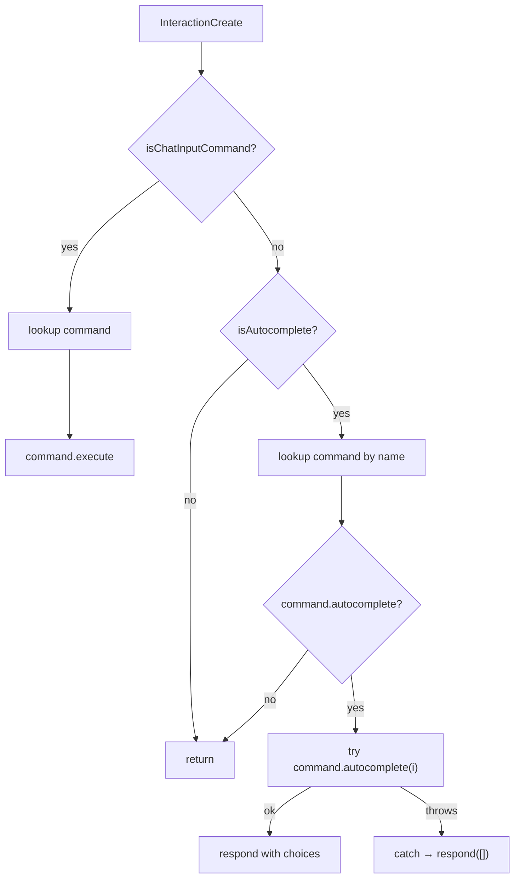
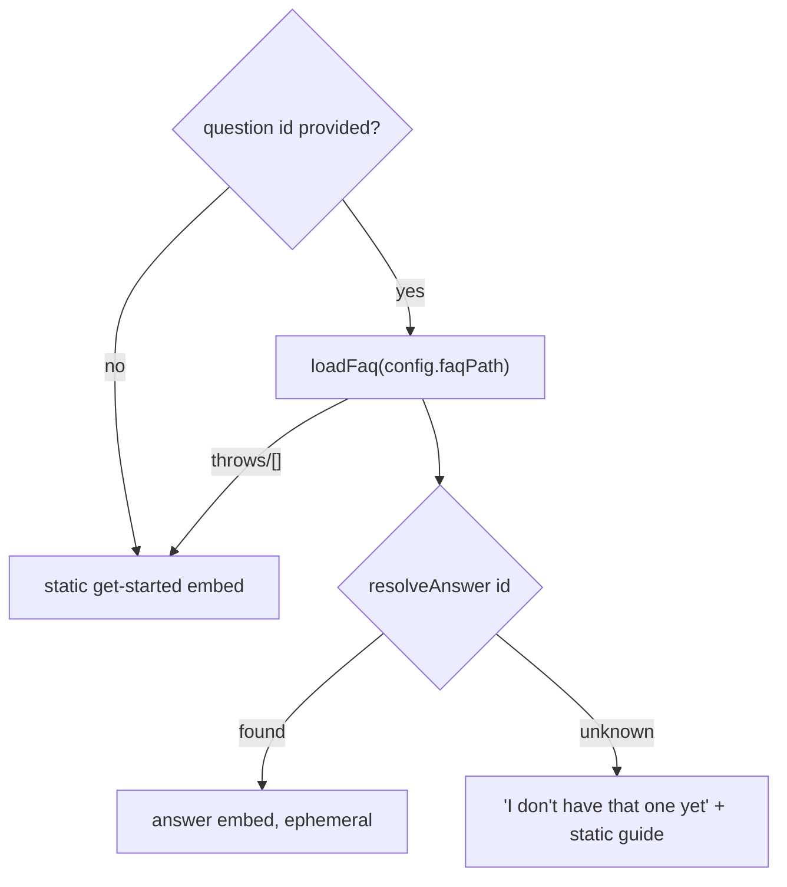

# feat: `/faq` extensible Q&A with autocomplete

**Target repo:** andamio-bot · **Stack:** TypeScript, discord.js v14, better-sqlite3, vitest · **Branch base:** `main` @ `6d87310` (merge of #21)

---

## Summary

Today `/faq` is a single static "Getting started" embed with no argument (`src/commands/faq.ts`). The 06-26 reframe set the deliverable as an **extensible Q&A system** — `config/faq.json` + question autocomplete — but only the static half shipped. The live test on 2026-06-29 confirmed: typing `/faq ` offers no autocomplete because the command exposes no option.

This plan adds the deferred Q&A piece **without regressing the static guide**, and it does so by closing two generic command-infra gaps first:

1. The interaction loop drops autocomplete — `src/index.ts:147` does `if (!interaction.isChatInputCommand()) return;`, so no command's autocomplete handler can ever fire.
2. The `Command` interface (`src/index.ts:23`) has no autocomplete slot — there is nowhere for a per-command autocomplete handler to live.

Both fixes are wired through the `Command` interface, not special-cased to `faq`, so future course-pickers (`/preview`, `/progress`) reuse the same dispatch. `/faq` is merely the first consumer.

End state:
- `/faq` with **no question** → the existing static get-started embed, byte-for-byte unchanged.
- `/faq question:<id>` → renders that Q&A entry's answer embed, with **autocomplete** over the configured questions.
- Questions live in `config/faq.json` (path from optional `FAQ_PATH`, default `config/faq.json`); adding a question is a config edit + restart, no code change. A missing/unset config degrades silently to the static guide.

---

## Problem Frame

**Who:** Barça/Andamio Discord members; PS21 testing starts 2026-07-01. The static guide already meets the original onboarding pass-bar — this is the searchable-Q&A upgrade, additive only.

**Why now:** James asked to build the deferred Q&A half before launch. The two infra gaps are the real headline: the bot has *never* dispatched an autocomplete interaction, so this is foundational command infrastructure, not a one-off feature. The plan must wire autocomplete generically so `/preview` and `/progress` pickers inherit it for free. **If implementation special-cases `faq` inside `index.ts`, that is a defect against KTD2 — push back.**

**Constraints:**
- Static no-arg `/faq` must render byte-for-byte today's embed (`renderFaqEmbed` is the floor).
- The existing test suite (handoff cites ~300 cases; ~284 visible via grep, the rest table-driven) stays green; `tsc`, `eslint`, and CodeQL stay clean.
- No new **required** env var — existing deploys must boot unchanged.

---

## Requirements

Traceability to the handoff (`origin`):

- **R1 — Autocomplete dispatch (infra).** `src/index.ts` `interactionCreate` gains an `isAutocomplete()` branch: look up `client.commands.get(interaction.commandName)`, and if it exposes an `autocomplete` method, call it inside try/catch — on error, `interaction.respond([])` (never crash the bot, never leave Discord hanging). The existing chat-input path is unchanged; the `isChatInputCommand()` early-return no longer swallows autocomplete. → U1
- **R2 — `Command` interface gains optional `autocomplete`.** Add `autocomplete?: (interaction: AutocompleteInteraction) => Promise<void>` to the `Command` interface in `src/index.ts`. The loader keeps requiring `data` + `execute`; `autocomplete` is optional, so existing commands are untouched. → U1
- **R3 — FAQ config loader + env.** Add `faqPath` to `Config` from a **new optional** `FAQ_PATH` (default `config/faq.json`; **not** in `REQUIRED_VARS`). Add `loadFaq(path)` returning `FaqEntry[]`, with `parseFaq` validating shape and throwing a typed error on malformed content. A missing file (or absent/empty path) → `[]` (not a throw), so `/faq` degrades to the static guide. → U2, U3
- **R4 — `config/faq.json` schema + seed + docs.** `FaqEntry = { id: string; question: string; answer: string; aliases?: string[] }`. `id` is the stable autocomplete `value`; `question` is the display `name`; `answer` is the embed body. Ship a 3–5 entry seed `config/faq.json` + `config/faq.example.json` (mirrors `role-mappings.example.json`). Document `FAQ_PATH` in `.env.example`, the README command table, and `docs/CONCEPTS.md`. → U2 (schema), U5 (seed + docs)
- **R5 — `/faq` command rework.** Add a non-required string `question` option with `.setAutocomplete(true)`. Export an `autocomplete` handler: rank entries by case-insensitive substring match on `question` + `aliases`, prefix-matches first, cap at Discord's **25-choice** limit, `respond` with `{ name: question, value: id }`. `execute`: id provided + resolves → answer embed; id provided + unknown → friendly "I don't have that one yet" + static guide; id absent → static guide verbatim. → U4 (ranker/resolver), U6 (command)
- **R6 — Graceful + ephemeral.** All replies ephemeral. Config-read failure in `execute` → static guide (never an error to the user), matching the existing `loadMappings` try/catch in `faq.ts`. Autocomplete never throws to Discord. → U1, U6
- **R7 — Tests.** Unit-test the pure pieces: matcher/ranker (query → ranked, ≤25, alias hits, empty query, >25 cap), `loadFaq` (valid, malformed→throw, missing-file→[]), answer resolution (known id, unknown id, no id→static). Add a dispatch test for the autocomplete branch **if the harness supports it** (see U1 — `index.ts` has no test harness today). Suite stays green; `tsc` + lint + CodeQL clean. → embedded in U1–U6 test scenarios

---

## Key Technical Decisions

- **KTD1 — Static guide is the floor, never regressed.** No-question `/faq` renders byte-for-byte today's embed. `renderFaqEmbed` is untouched; the Q&A path is purely additive. The deferred "richer authoring workflow" stays deferred — config-file editing is the authoring surface. (see origin: KTD1)
- **KTD2 — Autocomplete dispatch is generic infra, not faq-special.** Wire it through the `Command` interface so any future command reuses it. The dispatch branch in `index.ts` looks up `command.autocomplete` by capability — it must never name `faq`. This is the build's headline. (see origin: KTD2)
- **KTD3 — `FAQ_PATH` optional with a default; missing file degrades, not throws.** `loadFaq` returns `[]` on a missing file or absent path; only *malformed* content throws (and only `parseFaq`, called where a caller can catch). This preserves the "renders when Andamio is down or unconfigured" property and adds zero required env vars. Mirrors the non-throwing posture of `loadCourseDisplayNames` (`src/andamio/course-names.ts`) while borrowing the parse/load split and typed errors of `loadMappings` (`src/gating/mappings.ts`). (see origin: KTD3)
- **KTD4 — `id` is the autocomplete `value`, `question` is the `name`.** Stable ids decouple answer lookup from question-text edits. The 25-choice cap is a hard Discord limit enforced inside the ranker, not the caller. (see origin: KTD4)
- **KTD5 — Pure logic lives outside the command file.** The loader/schema (`src/faq/config.ts`) and the ranker/resolver (`src/faq/match.ts`) are pure, dependency-free modules — directly unit-testable without a Discord interaction harness, mirroring how `src/gating/mappings.ts` and `src/gating/evaluator.ts` separate parse/validate logic from the command surface. `src/commands/faq.ts` stays thin: wire options, call the pure pieces, render embeds.
- **KTD6 — `index.ts` has no unit-test harness; dispatch stays thin.** `index.ts` runs `main()` at import and has no `index.test.ts`. R7's dispatch test is therefore conditional. Rather than retrofit a harness, keep the autocomplete branch minimal (lookup → guarded call → `respond([])` on error) and place verifiable logic in the per-command `autocomplete` handler (unit-tested in U6) and the ranker (U4). If a low-cost extraction of a `handleAutocomplete(client, interaction)` helper into a testable module is clean, do it; otherwise document the gap honestly rather than forcing a brittle harness. Restart re-registers commands from `data.toJSON()` on boot, so the new `question` option ships with a redeploy — note in the PR. (see origin: KTD5)

---

## High-Level Technical Design

Interaction routing after U1 (the generic branch is the load-bearing change):



`/faq` answer-resolution path in `execute` (R5):



Module boundaries (new `src/faq/` mirrors `src/gating/`):

```
src/faq/
  config.ts   # FaqEntry, parseFaq (throws on malformed), loadFaq (missing→[])
  match.ts    # rankFaqEntries(entries, query, limit=25) → {name,value}[]; resolveAnswer(entries, id)
```

---

## Output Structure

New files this plan creates:

```
config/
  faq.json            # seed: 3–5 real Q&A entries
  faq.example.json    # committed template (mirrors role-mappings.example.json)
src/faq/
  config.ts           # FaqEntry + parseFaq + loadFaq
  config.test.ts
  match.ts            # rankFaqEntries + resolveAnswer
  match.test.ts
```

Modified: `src/index.ts`, `src/config.ts`, `src/config.test.ts`, `src/commands/faq.ts`, `src/commands/faq.test.ts`, `.env.example`, `README.md`, `docs/CONCEPTS.md`.

---

## Implementation Units

### U1. Autocomplete infra: `Command.autocomplete` slot + dispatch branch

**Goal:** Make the bot able to dispatch *any* command's autocomplete handler. No user-visible change yet; unblocks `/faq` and all future autocomplete.

**Requirements:** R1, R2, R6 (autocomplete never throws to Discord).

**Dependencies:** none.

**Files:** `src/index.ts` (modify).

**Approach:**
- Add to the `Command` interface (`src/index.ts:23`): `autocomplete?: (interaction: AutocompleteInteraction) => Promise<void>`. Import `AutocompleteInteraction` from `discord.js`.
- In the `Events.InteractionCreate` handler (`src/index.ts:146`), keep the chat-input path exactly as-is. Add a sibling branch: if `interaction.isAutocomplete()`, look up `client.commands.get(interaction.commandName)`; if it has an `autocomplete` method, call it in try/catch; on error log and `await interaction.respond([])` (guarded — `respond` itself can throw if the interaction already expired, so wrap defensively). Restructure the early-return so neither branch swallows the other (e.g. handle chat-input, then autocomplete, then return).
- The loader (`loadCommands`, `src/index.ts:57`) and `deploy-commands.ts` keep their `'data' in command && 'execute' in command` guard — `autocomplete` is optional, so no loader change is required. `command-loader.ts` only filters *filenames* (`isCommandModule`); it does not type-guard module shape, so it needs no change. Note this explicitly so a reviewer doesn't expect a `command-loader.ts` edit (R2's "mirror … if it type-guards" clause does not apply here).
- Per KTD6: keep the branch thin. Optionally extract a `handleAutocomplete(client, interaction)` into a small importable module if it lands cleanly enough to unit-test; do not retrofit a full `index.ts` harness.

**Patterns to follow:** the existing chat-input try/catch (`src/index.ts:155-168`) — mirror its error-logging shape and ephemeral-safety instinct.

**Test scenarios:**
- If `handleAutocomplete` is extracted to a testable module: command with an `autocomplete` method → it is invoked with the interaction; command without one → no-op (no throw); handler throws → `respond([])` is called once; unknown command name → no-op. 
- If not extracted (KTD6): `Test expectation: none — index.ts has no harness; dispatch behavior is exercised indirectly by U6's autocomplete-handler tests and manual verification.` State which path was taken in the PR.

**Verification:** `tsc` clean with the new interface member; bot boots; manual `/faq ` (after U6) surfaces choices; an intentionally-throwing handler returns an empty list instead of crashing the process.

---

### U2. FAQ config: `FaqEntry` schema + `parseFaq` + `loadFaq`

**Goal:** A pure, tested loader for the Q&A config that validates shape, throws a typed error on malformed content, and returns `[]` for a missing/absent file.

**Requirements:** R3 (loader), R4 (schema).

**Dependencies:** none.

**Files:** `src/faq/config.ts` (create), `src/faq/config.test.ts` (create).

**Approach:**
- Export `interface FaqEntry { id: string; question: string; answer: string; aliases?: string[] }`.
- `parseFaq(parsed: unknown): FaqEntry[]` — validate: top-level array; each entry an object with non-empty string `id`, `question`, `answer`; optional `aliases` an array of non-empty strings if present; reject duplicate `id`s (ids are the answer key — a dup would make resolution ambiguous). Throw `Error` with an entry-indexed message (`entry #N …`), mirroring `parseMappings`.
- `loadFaq(filePath: string | undefined): FaqEntry[]` — absent/empty `filePath` → `[]`; file-not-found (`ENOENT`) → `[]`; **malformed JSON or shape → throw** (so a caller in `execute` can catch and fall back, while a future strict caller could surface it). Distinguish ENOENT (return `[]`) from other read errors per judgment — ENOENT is the "unconfigured" degrade path; treat a genuinely missing file as empty, not an error.

**Patterns to follow:** `src/gating/mappings.ts` for the `parseX`/`loadX` split, fail-fast indexed messages, and `isNonEmptyString` helper. `src/andamio/course-names.ts` for the non-throwing "absent → empty" posture.

**Test scenarios:**
- `parseFaq` valid array of 3 entries → returns 3 typed entries; `aliases` preserved when present and omitted when absent.
- `parseFaq` non-array (object, string, null) → throws.
- `parseFaq` entry missing `id` / `question` / `answer`, or with empty-string values → throws naming the entry index.
- `parseFaq` entry with non-array or non-string-element `aliases` → throws.
- `parseFaq` duplicate `id` across two entries → throws.
- `loadFaq` on a real temp file with valid JSON → returns parsed entries.
- `loadFaq` on a missing path → `[]` (no throw). Covers the degrade-to-static property.
- `loadFaq` on `undefined`/empty-string path → `[]`.
- `loadFaq` on a file with malformed JSON → throws.

**Verification:** `vitest run src/faq/config.test.ts` green; `tsc` clean.

---

### U3. Wire `FAQ_PATH` into `Config`

**Goal:** Surface `faqPath` on `Config` from optional `FAQ_PATH`, defaulting to `config/faq.json`, without adding a required env var.

**Requirements:** R3 (env).

**Dependencies:** none (parallel to U2).

**Files:** `src/config.ts` (modify), `src/config.test.ts` (modify).

**Approach:**
- Add `faqPath: string;` to the `Config` interface with a doc comment.
- In `loadConfig`, set `faqPath: isPresent(env.FAQ_PATH) ? env.FAQ_PATH.trim() : 'config/faq.json'`. Do **not** add `FAQ_PATH` to `REQUIRED_VARS` or `URL_VARS`.
- No `doctor.ts` change — the doctor checks `REQUIRED_VARS`, and `FAQ_PATH` is optional-with-default. Confirm `doctor.test.ts` still passes unchanged.

**Patterns to follow:** the optional `modRoleId` handling (`src/config.ts:124-125`) — same `isPresent`/trim shape, but with a non-empty default instead of `undefined`.

**Test scenarios:**
- `loadConfig` with `FAQ_PATH` unset → `faqPath === 'config/faq.json'`.
- `loadConfig` with `FAQ_PATH` set to a custom path → `faqPath` is that trimmed value.
- `loadConfig` with `FAQ_PATH` blank/whitespace → falls back to the default.
- Existing required-var and URL-var tests remain green (no new required var).

**Verification:** `vitest run src/config.test.ts src/doctor.test.ts` green; `tsc` clean.

---

### U4. Matcher/ranker + answer resolver

**Goal:** Pure functions that turn a query into ≤25 ranked autocomplete choices and resolve an id to its entry.

**Requirements:** R5 (ranking + resolution logic), R7.

**Dependencies:** U2 (`FaqEntry` type).

**Files:** `src/faq/match.ts` (create), `src/faq/match.test.ts` (create).

**Approach:**
- `rankFaqEntries(entries: FaqEntry[], query: string, limit = 25): { name: string; value: string }[]`:
  - Case-insensitive substring match on `question` and any `aliases`.
  - Empty/whitespace query → all entries (still capped at `limit`), in config order.
  - Rank prefix-matches (query is a prefix of `question`, case-insensitive) before mid-string substring matches; stable within each tier (config order). Alias-only matches count as matches but rank after question matches (judgment — keep deterministic).
  - Truncate to `limit` (hard 25 cap per Discord). `name` = `question`, `value` = `id`.
  - Guard `name` length to Discord's 100-char limit if any seed question could exceed it (truncate defensively) — note as a low-risk edge.
- `resolveAnswer(entries: FaqEntry[], id: string): FaqEntry | undefined` — exact `id` match.

**Patterns to follow:** pure-function style of `src/gating/evaluator.ts` (logic separated from the command surface, fully unit-tested).

**Test scenarios:**
- Empty query → returns all entries, config order, capped at 25.
- Query matching 30 entries → returns exactly 25. Covers the hard Discord cap (KTD4).
- Prefix match ranks above mid-string substring match for the same query.
- Case-insensitive: `"CONNECT"` matches `"How do I connect…"`.
- Alias hit: a query matching only an `aliases` entry still returns that entry.
- No match → empty array.
- `resolveAnswer` known id → the entry; unknown id → `undefined`; empty `entries` → `undefined`.
- Choice shape: each result is `{ name: <question>, value: <id> }`.

**Verification:** `vitest run src/faq/match.test.ts` green; `tsc` clean.

---

### U5. Seed `config/faq.json`, `faq.example.json`, and docs

**Goal:** Ship real Q&A content and document the new config surface.

**Requirements:** R4 (seed + docs).

**Dependencies:** U2 (must satisfy `parseFaq`).

**Files:** `config/faq.json` (create), `config/faq.example.json` (create), `.env.example` (modify), `README.md` (modify), `docs/CONCEPTS.md` (modify).

**Approach:**
- `config/faq.json`: 3–5 real entries grounded in the bot's actual commands, e.g.:
  - `connect-account` — "How do I connect my Andamio account?" → points at `/login`.
  - `cant-see-channel` — "Why can't I see a channel?" → `/check` + `/available`, gating explanation.
  - `check-progress` / `what-i-hold` — "How do I see my credentials?" → `/credentials`.
  - aliases where natural (e.g. `cant-see-channel` aliases `["locked channel", "missing channel", "access"]`).
- `config/faq.example.json`: same shape, illustrative placeholder content (mirrors `config/role-mappings.example.json` convention). This is the committed template; `config/faq.json` is the live seed (committed here since it has no secrets).
- `.env.example`: add an `# OPTIONAL: FAQ_PATH` block under the Optional section, matching the existing comment style (what it is, default `./config/faq.json`, "missing file → static guide only").
- `README.md`: update the `/faq` row in the command table (line ~43) to mention the optional `question:` autocomplete and the `FAQ_PATH` config; add `FAQ_PATH` wherever optional env vars are listed if such a list exists.
- `docs/CONCEPTS.md`: add an entry defining the FAQ Q&A config (FaqEntry, id-as-value, config-as-authoring-surface), following the file's existing entry format.

**Patterns to follow:** `config/role-mappings.example.json` (example-file convention); the `.env.example` Optional-section comment style; existing `docs/CONCEPTS.md` entries.

**Test scenarios:**
- Add a guard test (in `src/faq/config.test.ts`): `loadFaq('config/faq.json')` parses without throwing and yields ≥3 entries with unique ids. Covers AE: the shipped seed is always valid config (prevents a broken seed reaching production).
- Docs changes: `Test expectation: none — documentation/seed content.`

**Verification:** `loadFaq` guard test green; manual read of `.env.example`/README/CONCEPTS for accuracy.

---

### U6. `/faq` command rework: option, autocomplete handler, answer rendering, fallback

**Goal:** Wire the pure pieces into the command — add the `question` option, export the `autocomplete` handler, and branch `execute` between answer embed and the static guide, preserving the static path byte-for-byte.

**Requirements:** R5, R6, R7.

**Dependencies:** U1 (dispatch + interface), U2 (`loadFaq`), U3 (`config.faqPath`), U4 (ranker + resolver).

**Files:** `src/commands/faq.ts` (modify), `src/commands/faq.test.ts` (modify).

**Approach:**
- `data`: add `.addStringOption(o => o.setName('question').setDescription('Search the FAQ (optional)').setRequired(false).setAutocomplete(true))`.
- Export `async function autocomplete(interaction: AutocompleteInteraction)`: read `interaction.options.getFocused()`; `loadFaq(loadConfig().faqPath)` inside try/catch (a config/parse failure → `respond([])`, never throw); `rankFaqEntries(entries, focused)`; `await interaction.respond(choices)`. This satisfies R6 (autocomplete never throws to Discord) at the handler level too, complementing U1's dispatch guard.
- Rework `execute`:
  - Read `const id = interaction.options.getString('question')`.
  - `id` absent (null) → render the existing static guide via `renderFaqEmbed(mappings, names)` exactly as today (unchanged code path).
  - `id` present → `loadFaq(config.faqPath)` in try/catch; on failure → static guide (R6). `resolveAnswer(entries, id)`: found → render an answer embed (`EmbedBuilder` titled with the `question`, description = `answer`); unknown → reply with a friendly "I don't have that one yet" line **plus** the static guide.
  - All replies keep `flags: MessageFlags.Ephemeral`.
- Add a `renderAnswerEmbed(entry: FaqEntry): EmbedBuilder` helper (pure, testable) for the answer embed.
- **Keep `renderFaqEmbed` untouched** — the static floor (KTD1).

**Critical test-harness note (keep the suite green):** the existing `FakeInteraction` in `src/commands/faq.test.ts:35` has no `.options`. Once `execute` calls `interaction.options.getString('question')`, those existing tests will throw unless `FakeInteraction` gains an `options.getString` stub returning `null` by default. Update the helper so the existing no-id tests still drive the static path (returning `null`), and add new tests that return an id. This is the main "300 stays green" hazard — handle it in this unit. Additionally, the existing `loadConfig` mock (`src/commands/faq.test.ts:9-17`) returns a fixed config with **no `faqPath`** — the no-id path is unaffected (it never reads `faqPath`), but the new id-present tests will call `loadFaq(config.faqPath)` with `faqPath === undefined`; add `faqPath` to that mock (or mock `loadFaq` directly) so the happy-path "known id → answer embed" test exercises the real resolver.

**Patterns to follow:** the existing `execute` try/catch around `loadMappings` (`src/commands/faq.ts:85-90`) for the degrade-to-static instinct; `renderFaqEmbed` for `EmbedBuilder` usage and ephemeral reply shape.

**Test scenarios:**
- `execute` with no `question` (options.getString → null) → static guide, ephemeral; **existing static-path tests stay green** (byte-for-byte, KTD1). Covers the floor.
- `execute` with a known id → answer embed whose title/body come from the entry; ephemeral.
- `execute` with an unknown id → reply contains the friendly "don't have that one yet" copy AND the static guide; ephemeral; no throw.
- `execute` where `loadFaq` throws (malformed config) → static guide, no error surfaced to the user (R6). Mock `loadFaq` to throw.
- `autocomplete` with a focused query → `interaction.respond` called once with ranked `{name,value}` choices (≤25).
- `autocomplete` where `loadFaq`/`loadConfig` throws → `interaction.respond([])` called, no throw (R6).
- `autocomplete` with empty focused string → responds with all entries (capped 25).

**Verification:** full `vitest run` green (suite stays at ~300); `tsc` clean; `eslint . --ext .ts` clean; manual `/faq ` shows choices, `/faq question:<known>` shows the answer, `/faq` alone shows the unchanged guide.

---

## Scope Boundaries

**In scope:** the two infra fixes (R1/R2), the FAQ loader + config + seed + docs (R3/R4), and the `/faq` rework with autocomplete + fallback (R5/R6), plus unit tests (R7).

### Deferred for later (from origin)
- Rich authoring workflow / in-Discord FAQ editing.
- Per-question images/video, multi-embed answers.
- Pulling FAQ content from the Andamio API (config file is the source for now).

### Deferred to Follow-Up Work (plan-local)
- Reusing the new autocomplete dispatch for `/preview` and `/progress` course-pickers — explicitly enabled by U1 but built in their own PRs.
- Retrofitting an `index.ts` unit-test harness for the dispatch branch (KTD6) — only if a future change makes it cheap.

---

## Risks & Dependencies

- **R-1 — Existing `/faq` tests break on the new `options` read.** `FakeInteraction` lacks `.options`. *Mitigation:* U6 updates the test helper to stub `options.getString` returning `null`; the static-path assertions then pass unchanged. Flagged as the primary suite-green hazard.
- **R-2 — Special-casing `faq` in `index.ts`.** Violates KTD2 and defeats the build's purpose. *Mitigation:* U1's dispatch looks up `command.autocomplete` by capability only; review gate — reject any `faq`-named branch in `index.ts`.
- **R-3 — `loadFaq` throwing on a missing file would regress the static guide.** *Mitigation:* U2 returns `[]` on ENOENT/absent path; dedicated test asserts missing-file → `[]`.
- **R-4 — Discord 25-choice / 100-char limits.** Exceeding either makes `respond` fail. *Mitigation:* U4 enforces the 25 cap in the ranker and defensively truncates long `name` values.
- **R-5 — Autocomplete latency / expiry.** A slow handler or an already-expired interaction makes `respond` throw. *Mitigation:* `loadFaq` is a small local file read; both U1 (dispatch) and U6 (handler) wrap `respond` in try/catch.
- **Dependency note:** restart re-registers commands from `data.toJSON()` on boot (`src/index.ts:113`), so the new `question` option ships automatically on redeploy — call this out in the PR per KTD6/origin KTD5.

---

## Documentation Plan

- `.env.example` — document optional `FAQ_PATH` (U5).
- `README.md` — update the `/faq` command-table row (U5).
- `docs/CONCEPTS.md` — add the FAQ Q&A config concept (U5).
- PR body — note the restart-registers-the-option deploy step and which U1 dispatch-test path was taken (KTD6).

---

## Sources & Research

- Local patterns (no external research needed — discord.js v14 autocomplete APIs are standard and local loader/config patterns are strong, 3+ direct examples):
  - `src/gating/mappings.ts` — `parseX`/`loadX` split, fail-fast typed errors (model for `parseFaq`/`loadFaq`).
  - `src/andamio/course-names.ts` — optional, non-throwing "absent → empty" config posture.
  - `src/config.ts` — optional env var with `isPresent`/trim (`modRoleId`) and `REQUIRED_VARS` discipline.
  - `src/commands/faq.ts` / `faq.test.ts` — the static floor and its test harness.
  - `src/index.ts` — the `Command` interface and `interactionCreate` dispatch.
- discord.js v14: `AutocompleteInteraction`, `interaction.isAutocomplete()`, `interaction.options.getFocused()`, `interaction.respond([{name,value}])`, `SlashCommandBuilder#addStringOption().setAutocomplete(true)` — standard, in-repo dependency (`discord.js ^14.14.1`).
- Origin handoff: `docs/plans/2026-06-29-002-feat-faq-qa-autocomplete-handoff.md`.
