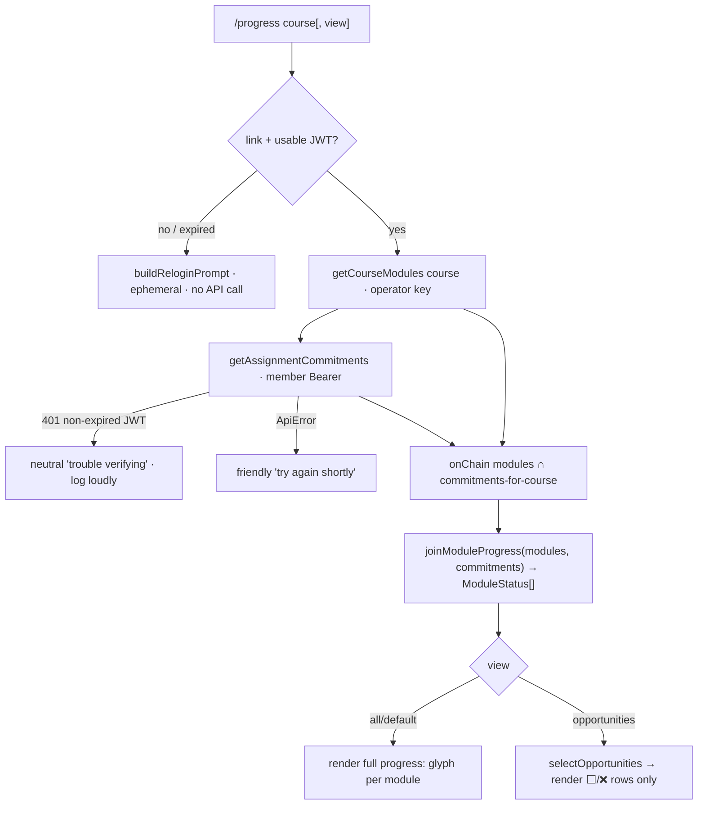

# feat: `/progress` + opportunities — per-module status and open assignments

**Target repo:** andamio-bot · **Stack:** TypeScript, discord.js, vitest · **Branch:** `feat/progress-opportunities` (base `main` after #24/#25)

---

## Summary

Feature 3 of the launch set. For a connected member's enrolled gated course, `/progress` renders every on-chain module with the member's commitment status as a status glyph (✅/📝/✍️/⬜/❌); the not-started/refused rows **are** the open "opportunities," surfaced as a second view off the same join. Built on the **live-confirmed** content-client from #24/#25 (`getCourseModules`, on-chain predicate keyed on `slt_hash`) joined with the member's assignment commitments (`getAssignmentCommitments`, member Bearer). Course Modules ↔ Assignments are **1:1** (product fact), so per-assignment commitment status *is* per-module progress, and a module with no/refused commitment *is* an open opportunity.

The single highest-risk item is **Step 0 (U0)**: the `commitments.json` fixture is still source-mapped, not live-confirmed (the fixtures README says so explicitly). Following the #24/#25 lesson, U0 must capture a real mainnet response with a member JWT and reconcile fixture/mapper/types **before** any join code is written. U0 is a hard gate — if no enrolled test member exists, STOP and flag rather than build on the guess.

---

## Problem Frame

The bot can already show what a member *holds* (`/credentials`) and *previews* public content (`/preview`), but nothing shows a member their *per-module progress* or *what's left to do* in a course they're enrolled in. `/progress` closes that gap and doubles as the opportunity surface — the launch's biggest user-value slice — with zero new role-gating authority (display-only, like `/preview`).

---

## Requirements

Traced from the origin handoff (R1–R7) and its KTDs.

- **R1 — `getAssignmentCommitments` confirmed against mainnet.** The content-client method (operator key + member Bearer, `POST …/assignment-commitments/list`) returns the member's commitments with `status` ∈ {DRAFT, SUBMITTED, APPROVED, REFUSED, …}, keyed by course + module, mapped off the **live-confirmed** fixture. Same `ApiError`/timeout discipline as the rest of the client. (origin R1)
- **R2 — `joinModuleProgress(modules, commitments) → ModuleStatus[]` (pure).** Single source of truth for both views. For each module, attach the member's commitment status or `NONE`. Pure, total, no I/O, unit-tested off confirmed fixtures. (origin R2 / KTD2)
- **R3 — `/progress` command.** For a connected member's enrolled course, render every on-chain module with status glyphs: ✅ approved · 📝 submitted · ✍️ draft · ⬜ not started · ❌ refused. Requires a connected member — reuse the `isExpired` / `buildReloginPrompt` reconnect path from `credentials.ts`. On-chain modules only — reuse the `onChain` (`slt_hash`) predicate from #25. Course selection via the curated `loadDisplayFilter` / `course-names` path, autocompleting the member's enrolled gated courses. (origin R3)
- **R4 — Opportunities.** "Open opportunities" = modules whose assignment has **no commitment or a refused one** (status `NONE` or `REFUSED`). Surfaced as a second view off the same join — an `opportunities` view of `/progress` rendering only the ⬜/❌ rows. (origin R4 / KTD2)
- **R5 — Graceful + ephemeral.** All replies ephemeral. `ApiError` → "try again shortly"; missing/expired JWT → the reconnect prompt (not an error); 401 on the authed commitments read with a non-expired JWT → neutral "trouble verifying right now" (the operator-key branch, mirroring `credentials.ts`). Empty enrolled set → friendly "you're not enrolled in a gated course here yet." No command throws. (origin R5)
- **R6 — Tests.** `joinModuleProgress` (every status branch, none-commitment, refused), the opportunity filter, glyph mapping, and the enrolled-course selection — all off confirmed fixtures. Suite stays green; `tsc` + lint + CodeQL clean. (origin R6)
- **R7 — Compound doc → #23 branch.** Any learnings/compound doc this build produces is committed onto the long-lived `docs/compound-autocomplete-pattern` branch (PR #23), **not** this feature branch. (origin R7)

---

## Key Technical Decisions

- **KTD1 — Step 0 is a hard gate, executed first as its own commit (U0).** The `commitments.json` fixture is still source-mapped (`__fixtures__/content/README.md`: "remains **source-mapped, not yet live-confirmed**"). The `mapCommitments` mapper, `AssignmentCommitment`/`CommitmentStatus` types, and `getAssignmentCommitments` fetch already exist (scaffolded in #24) but were never validated against a real authed response. U0 captures a live mainnet response with a member JWT, diffs it against the fixture, and reconciles fixture + mapper + types as one commit before any join code. If no enrolled test member exists → STOP and flag. (origin Step 0 / KTD4)
- **KTD2 — One join, two views.** `/progress` (all on-chain rows) and the opportunities view (⬜/❌ rows) read the same `ModuleStatus[]` from one pure `joinModuleProgress`. A single `view` option on one command selects the render; no second data path, no second command-registration file. (origin KTD2)
- **KTD3 — Display-only; never feeds gating.** `/progress` reads commitments but must never influence role add/remove. It lives in the content-client lane (display-only), never touching `dashboard-client`'s `partial`/`isDegraded` gating contract. (origin KTD3)
- **KTD4 — Validate against mainnet (`api.andamio.io`), member Bearer + operator key.** Same environment correction as #24 — preprod was the original 401 cause. (origin KTD4)
- **KTD5 — Caller scopes commitments by course; the join keys on `moduleCode`.** `getAssignmentCommitments` returns the member's commitments across *all* courses (POST with empty body). `CourseModule` carries no `courseId`, so the command filters commitments to the chosen `courseId` *before* calling `joinModuleProgress`, which then matches purely on `moduleCode`. This keeps the join total and trivially unit-testable.
- **KTD6 — On-chain modules only.** The join (and both views) operate over modules filtered by the `onChain` (`slt_hash`) predicate, mirroring `/preview` post-#25. A non-on-chain module has no real assignment to commit to and must not appear as progress or an opportunity.

---

## High-Level Technical Design

Command flow (both views share everything up to the render split):



Status → glyph mapping (the render-layer contract):

| Commitment status | Glyph | Meaning | Opportunity? |
|---|---|---|---|
| `APPROVED` | ✅ | approved | no |
| `SUBMITTED` | 📝 | submitted, awaiting review | no |
| `DRAFT` | ✍️ | draft started | no |
| `NONE` (no commitment) | ⬜ | not started | **yes** |
| `REFUSED` | ❌ | refused | **yes** |
| unrecognized (passthrough) | ⬜ | shown as not-started, not crashed | treated as not-opportunity |

---

## Implementation Units

### U0. Step 0 — live-confirm `commitments.json` and reconcile (hard gate, own commit)

**Goal:** Replace the source-mapped guess with a live-confirmed `commitments.json`, reconciling the mapper/types if the real shape drifts (expect a `{ data: … }` envelope like every other endpoint). Land as its own commit (`fix(content): reconcile commitments fixture with live mainnet`), mirroring #24's content reconciliation.

**Requirements:** R1, KTD1, KTD4

**Dependencies:** none (must complete before U2–U4)

**Files:**
- `src/andamio/__fixtures__/content/commitments.json` (replace with captured live body)
- `src/andamio/__fixtures__/content/README.md` (flip the commitments row to LIVE-CONFIRMED, record capture date/course/member)
- `src/andamio/content-client.ts` (`mapCommitments`, `AssignmentCommitment`, `CommitmentStatus` — adjust field paths/envelope only if the live shape requires it)
- `src/andamio/content-client.test.ts` (update `mapCommitments` expectations to the confirmed shape; keep the bare-vs-enveloped tolerance tests)

**Approach — execution recipe (the part most likely to stall):**
1. Confirm an enrolled test member exists. James's own account holds the Andamio Issuer credential and is enrolled in the gated course `ae192632aabe00ed2042eaef596bc15f3887fa32e75e8f9b8fa516df` — if so, `/login` in Discord makes James the test member. **If no enrolled member can be found, STOP and surface that as a blocker — do not fabricate a fixture.**
2. Read the member JWT the bot persisted at login:
   ```
   sqlite3 "$DB_PATH" "SELECT alias, user_jwt, jwt_expires_at FROM links WHERE user_jwt IS NOT NULL ORDER BY updated_at DESC LIMIT 5;"
   ```
   (`jwt_expires_at` is epoch ms — re-`/login` if stale. `DB_PATH` and `ANDAMIO_API_KEY` come from the operator `.env`; per project memory the real key lives in the **main repo** `.env`, not a worktree copy.)
3. Capture the live response:
   ```
   curl -sS -X POST https://api.andamio.io/api/v2/course/student/assignment-commitments/list \
     -H "X-API-Key: $ANDAMIO_API_KEY" \
     -H "Authorization: Bearer <user_jwt>" \
     -H "Content-Type: application/json" -d '{}'
   ```
4. Diff against the current fixture. Confirm: the `{ data: … }` envelope (or its absence), the `status` enum values, and the course/module keying (`course_id` + `course_module_code` vs. other names). Reconcile fixture → mapper → types in that order. Because `mapCommitments` is already total and envelope-agnostic (`unwrap` + defensive `prop`), expect a fixture+expectation update, not a rewrite — but adjust field paths if the live keys differ.
5. Redact any member PII; the fixture must carry only course id / module code / status (as today). No JWT, alias, or wallet data in the committed fixture.

**Patterns to follow:** #24's `fix(content)` reconciliation and the `modules`/`slts` enveloped fixtures; the README's existing LIVE-CONFIRMED table format.

**Test scenarios:**
- `mapCommitments` maps the **confirmed** fixture into `{ courseId, moduleCode, status }[]` (update expected rows to match the captured body).
- Enveloped vs. bare body map identically (keep the `{ data: … }` tolerance test).
- Unrecognized status string passes through verbatim.
- Entry missing course id or module code is dropped.
- Empty / missing body → `[]`.

**Verification:** A real mainnet response is captured; the fixture reflects it; `content-client.test.ts` passes against the confirmed shape; the README commitments row reads LIVE-CONFIRMED with capture provenance; this lands as a standalone commit before U2 begins.

---

### U1. Confirm `getAssignmentCommitments` end-to-end against the reconciled shape

**Goal:** With the fixture confirmed, verify the authed fetch path (`getAssignmentCommitments`) still maps correctly and preserves the 401→`unauthorized` reconnect branch. Largely validation of existing #24 scaffolding against U0's reconciled fixture; adjust only if U0 changed field paths.

**Requirements:** R1, R5, KTD4

**Dependencies:** U0

**Files:**
- `src/andamio/content-client.ts` (only if U0 altered the response path)
- `src/andamio/content-client.test.ts` (`getAssignmentCommitments` describe block)

**Approach:** The existing tests already assert POST + `X-API-Key` + `Bearer` headers, empty `{}` body, 401→unauthorized, 500→http. Re-point the success-case expectation at the reconciled fixture. No new fetch behavior expected.

**Patterns to follow:** existing `getAssignmentCommitments` describe block in `content-client.test.ts`.

**Test scenarios:**
- POSTs the commitments path with `X-API-Key` **and** `Bearer <jwt>`, body `{}`, mapping to the confirmed fixture rows.
- 401 → `unauthorized` ApiError (the reconnect-prompt branch).
- 500 → `http` ApiError.

**Verification:** `getAssignmentCommitments` tests green against U0's fixture; the unauthorized branch is intact for U3 to catch.

---

### U2. `joinModuleProgress` pure module + opportunity selection + glyph mapping

**Goal:** The single pure join feeding both views, plus the opportunity filter and status→glyph map. No I/O, total, fully unit-tested.

**Requirements:** R2, R4, R6, KTD2, KTD5, KTD6

**Dependencies:** U0

**Files:**
- `src/andamio/module-progress.ts` (new)
- `src/andamio/module-progress.test.ts` (new)

**Approach:**
- Types: `type ModuleProgressStatus = CommitmentStatus | 'NONE'`; `interface ModuleStatus { module: CourseModule; status: ModuleProgressStatus }`.
- `joinModuleProgress(modules: CourseModule[], commitments: AssignmentCommitment[]): ModuleStatus[]` — for each module, find the commitment whose `moduleCode` matches (commitments are pre-scoped to the course by the caller, per KTD5); attach its `status` or `'NONE'`. Preserve module order. Pure and total — duplicate commitment codes resolve to the first match; modules with no match get `'NONE'`.
- `selectOpportunities(statuses: ModuleStatus[]): ModuleStatus[]` — keep rows where `status === 'NONE' || status === 'REFUSED'`.
- `statusGlyph(status: ModuleProgressStatus): string` — the mapping table in the HTD (✅/📝/✍️/⬜/❌, unrecognized → ⬜).
- `isOpportunity(status): boolean` helper shared by `selectOpportunities` and any render highlight.
- Re-import `CourseModule`, `AssignmentCommitment`, `CommitmentStatus` from `content-client.ts` — do not redefine.

**Patterns to follow:** the pure-helper style of `preview.ts` render/selection helpers (U2/U3 there) and the total-mapper discipline in `content-client.ts`.

**Test scenarios:**
- *Happy path:* modules + commitments covering APPROVED / SUBMITTED / DRAFT / REFUSED join to the right status per module, order preserved.
- *None branch:* a module with no matching commitment → `'NONE'`.
- *Refused branch:* a module with a REFUSED commitment → `'REFUSED'`.
- *Empty inputs:* `joinModuleProgress([], [])` → `[]`; `joinModuleProgress(modules, [])` → all `'NONE'`.
- *Extra commitments:* a commitment whose `moduleCode` matches no module is ignored (no phantom rows).
- *Unrecognized status:* a passthrough status string survives into `ModuleStatus.status` and maps to ⬜ via `statusGlyph`.
- *`selectOpportunities`:* returns exactly the `NONE` + `REFUSED` rows, in order; drops APPROVED/SUBMITTED/DRAFT.
- *`statusGlyph`:* each known status → its glyph; unknown → ⬜.

**Verification:** `module-progress.test.ts` passes every branch; no imports from `discord.js` or any fetch/db module (purity).

---

### U3. `/progress` command — full + opportunities views, reconnect path, enrolled-course autocomplete

**Goal:** Wire the command: reconnect-gated, ephemeral, on-chain-only, course-autocompleted, rendering the full progress view by default and the opportunities-only view when `view:opportunities` is chosen — both off one `joinModuleProgress`.

**Requirements:** R3, R4, R5, R6, KTD2, KTD3, KTD5, KTD6

**Dependencies:** U2 (and U0/U1 for the data path)

**Files:**
- `src/commands/progress.ts` (new — auto-loaded by `command-loader.ts`)
- `src/commands/progress.test.ts` (new)

**Approach:**
- `data`: `SlashCommandBuilder` named `progress`, with a required autocompleted `course` string option and an optional `view` string option (choices `all` default / `opportunities`).
- `autocomplete`: list the **member's enrolled, displayed** courses. Read the member's link + JWT; if connected, do a budgeted (`~2.5s`, the `withBudget` pattern from `preview.ts`) `getUserDashboard` read and offer `enrolledCourses ∩ isDisplayed`, labelled via `displayNameFor`. On no-connection / timeout / any error → respond `[]` (autocomplete never throws). Reuse `loadDisplayFilter`.
- `execute`:
  1. Reconnect gate — copy the `credentials.ts` shape exactly: no link or no `user_jwt` → `buildReloginPrompt(..., 'connect')`; `isExpired` → `buildReloginPrompt(..., 'expired')`. No API call in either case.
  2. `deferReply({ ephemeral })`, then `getCourseModules(course)` (operator key) and `getAssignmentCommitments(jwt)` (member Bearer).
  3. Filter modules to `onChain`; filter commitments to `c.courseId === courseId` (KTD5); `joinModuleProgress`.
  4. Render: default → full list, one line per module `‹glyph› **Title** (\`code\`)`; `opportunities` → `selectOpportunities` rows only, each linking to the assignment where one exists. Use `fitFieldValue` for the 1024-char cap and an `EmbedBuilder`, mirroring `/preview` and `/credentials`.
  5. Empty enrolled/on-chain set → friendly "you're not enrolled in a gated course here yet" / "nothing to show yet."
- Error handling mirrors `credentials.ts`: `ApiError unauthorized` on the authed read with a non-expired JWT → neutral "trouble verifying right now" + `console.error` (operator-key suspect); other `ApiError` / unexpected → "try again shortly" (log non-ApiError). No throw to the user.

**Execution note:** Reuse, do not re-implement — `buildReloginPrompt`, `isExpired`, `loadDisplayFilter`, `displayNameFor`/`isDisplayed`, `withBudget`, `fitFieldValue`, `getUserDashboard` all exist. New code is the render/select wiring plus the two-view split.

**Patterns to follow:** `src/commands/credentials.ts` (reconnect gate + 401 branch), `src/commands/preview.ts` (autocomplete + `withBudget` + ephemeral defer + render helpers), `src/commands/preview.test.ts` (command test structure with fetch/db mocks).

**Test scenarios:**
- *Reconnect:* no link → relogin `connect` prompt, **no** API call; expired JWT → relogin `expired` prompt, no API call.
- *Happy full view:* connected member, course with on-chain modules + mixed commitments → embed lists each module with the correct glyph; off-chain modules excluded.
- *Opportunities view:* `view:opportunities` → only ⬜/❌ rows rendered; APPROVED/SUBMITTED/DRAFT omitted.
- *Empty:* member enrolled but course has no on-chain modules → friendly empty note (not an error); opportunities view with zero opportunities → "you're all caught up"-style note.
- *401 on authed read (non-expired JWT):* neutral "trouble verifying" reply + `console.error`, no throw.
- *ApiError (network/http):* "try again shortly" ephemeral reply.
- *Autocomplete:* connected member → enrolled ∩ displayed courses labelled by display name; unconnected / API failure / timeout → `[]`; autocomplete never throws.
- *Ephemerality:* every reply path sets the ephemeral flag.
- *Course scoping (KTD5):* commitments from another course are not joined into the chosen course's modules.

**Verification:** `/progress` appears via the reflective loader; all command tests green; manual smoke against mainnet shows correct glyphs for the test member's real course; no reply throws.

---

### U4. Docs + compound learnings (compound doc → #23 branch)

**Goal:** Update the fixtures README provenance (done in U0) and, if this build yields a reusable learning (e.g., "authed fixtures drift like public ones — confirm before joining"), write the compound doc **onto the `docs/compound-autocomplete-pattern` branch**, not this feature branch.

**Requirements:** R7

**Dependencies:** U0–U3

**Files:**
- `docs/solutions/…` **on branch `docs/compound-autocomplete-pattern`** only (not committed to `feat/progress-opportunities`)

**Approach:** Keep the feature branch free of the compound doc. If a learning is worth capturing, check out / cherry-add it on the long-lived `docs/compound-autocomplete-pattern` branch (PR #23) per origin R7. This unit is bookkeeping — no production code.

**Test scenarios:** Test expectation: none — documentation/branch-hygiene only.

**Verification:** No compound/learnings doc is added to `feat/progress-opportunities`; any such doc lives on `docs/compound-autocomplete-pattern`.

---

## Scope Boundaries

**In scope:** the commitments fixture reconciliation (U0), the pure join + opportunity/glyph helpers (U2), and a single `/progress` command with `all`/`opportunities` views (U3), all ephemeral and display-only.

### Deferred to Follow-Up Work
- `/deny #channel` (PR 4 — separate handoff).
- A standalone `/opportunities` slash command (the `view:opportunities` option covers the need without a second registration file; promote to its own command later only if discoverability demands it).

### Outside this product's identity
- Project tasks/bounties as opportunities; commemorative-NFT discovery; per-SLT sub-module percentage. `/progress` must never influence role gating (KTD3).

---

## Risks & Dependencies

- **Step 0 stall (highest risk).** No enrolled test member → cannot confirm the fixture. Mitigation: James's account holds the Issuer credential; `/login` and read the JWT from `links`. Hard-stop and flag if truly unavailable — do not build on the guess. (U0)
- **Commitments shape drift larger than expected.** If the live keys differ from `course_id`/`course_module_code`/`status`, U0 adjusts mapper field paths (the total/`unwrap` design absorbs the envelope automatically). (U0/U1)
- **Member JWT in the autocomplete path.** The enrolled-course autocomplete needs a budgeted dashboard read; a slow API must degrade to `[]` within Discord's ~3s window. Mitigation: reuse `preview.ts`'s `withBudget`. (U3)
- **Operator key location.** Per project memory, the real `ANDAMIO_API_KEY` is in the main repo `.env`, not the worktree copy — use it for the U0 live capture.

---

## Sources & Research

- Origin handoff: `docs/plans/2026-06-29-004-feat-progress-opportunities-handoff.md`
- Live-confirmed content client + on-chain (`slt_hash`) predicate: `src/andamio/content-client.ts` (#24/#25), `src/andamio/__fixtures__/content/README.md`
- Reconnect pattern: `src/commands/credentials.ts`, `src/discord/relogin-prompt.ts`, `src/andamio/jwt.ts`
- Autocomplete + budgeted read + render pattern: `src/commands/preview.ts`, `src/commands/display-filter.ts`, `src/andamio/course-names.ts`
- JWT persistence (Step 0 recipe): `src/db/links.ts`, `DB_PATH` / `ANDAMIO_API_KEY` in `src/config.ts`
